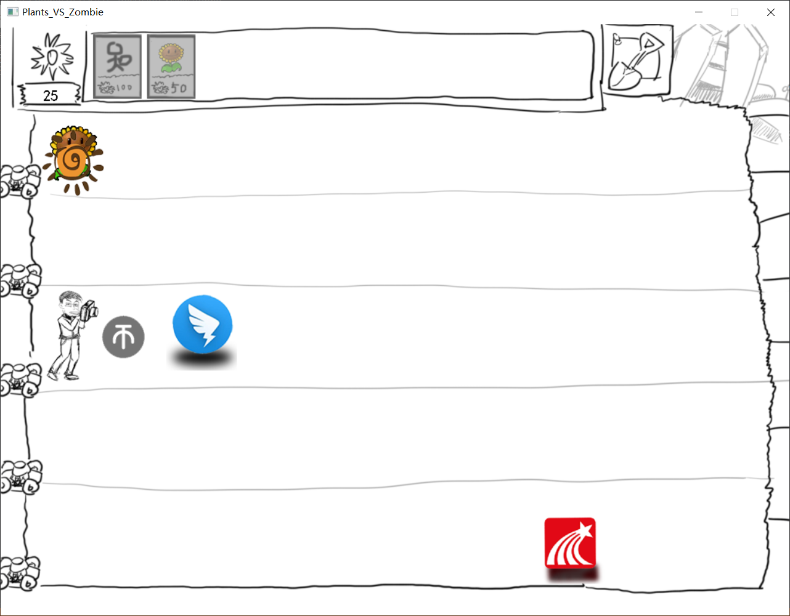
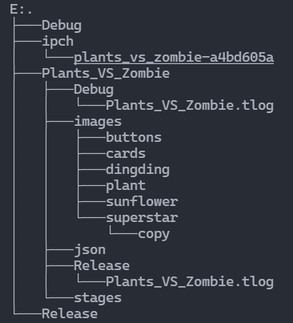

# 普通大学生大战网课平台

## 简介
+ 本仓库是使用了EasyX图形库的C++仿“植物大战僵尸”小游戏。
+ 是四川大学2021-2022学年张轶老师的研究与开发实践课课程设计。
+ 有三个简单的关卡，循序渐进。
+ 运用了一定程度面向对象的封装方法，便于进一步维护。
## 运行截图

## 目录情况
### 结构

+ 本仓库引用了开源的Json解析库[JsonXX](https://github.com/hjiang/jsonxx/tree/legacy)，资源保存在`json`路径下。
+ 所有的逻辑代码均在`Plants_VS_Zombie`文件夹下，其中还包括一个Python的“[关卡生成器](Plants_VS_Zombie/Plants_VS_Zombie/stageGenertator.py)”,执行后可以生成某一个关卡的所有数据，会映射到游戏环境中。
### 代码统计
使用了VScode的`VSCodeCounter`插件进行代码统计，此工具去除了所有的空行，并标注了注释行，结果如下：
 
| language | files | code | comment | blank | total | 备注|
| :--- | ---: | ---: | ---: | ---: | ---: | :---:|
| C++ | 15 | 1,837 | 105 | 122 | 2,064 |其中500余行来自外部JSON库|
| XML | 1 | 106 | 0 | 0 | 106 |VS的项目组织工具|
| JSON | 3 | 60 | 0 | 0 | 60 |保存关卡信息|
| Python | 1 | 28 | 1 | 3 | 32 |生成关卡信息|
| Django txt | 1 | 19 | 0 | 12 | 31 ||
| Markdown | 1 | 13 | 0 | 1 | 14 ||

[统计详情参见](details.md)

